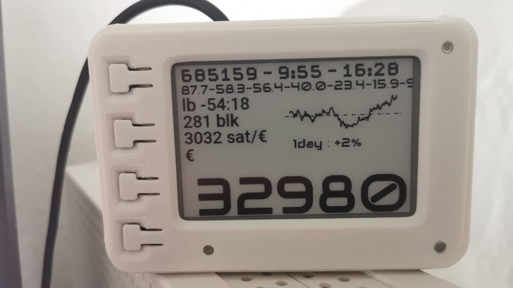
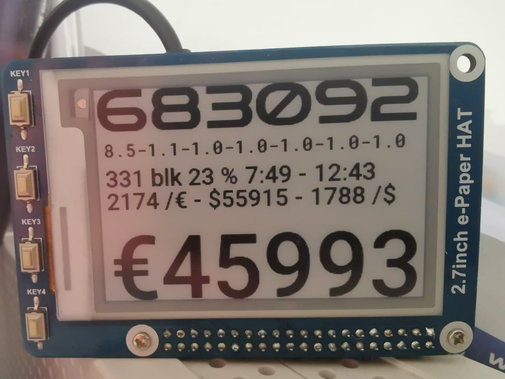
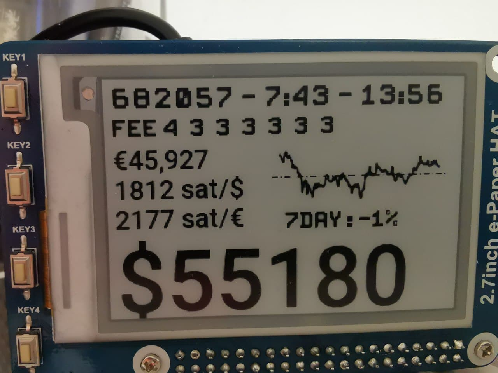
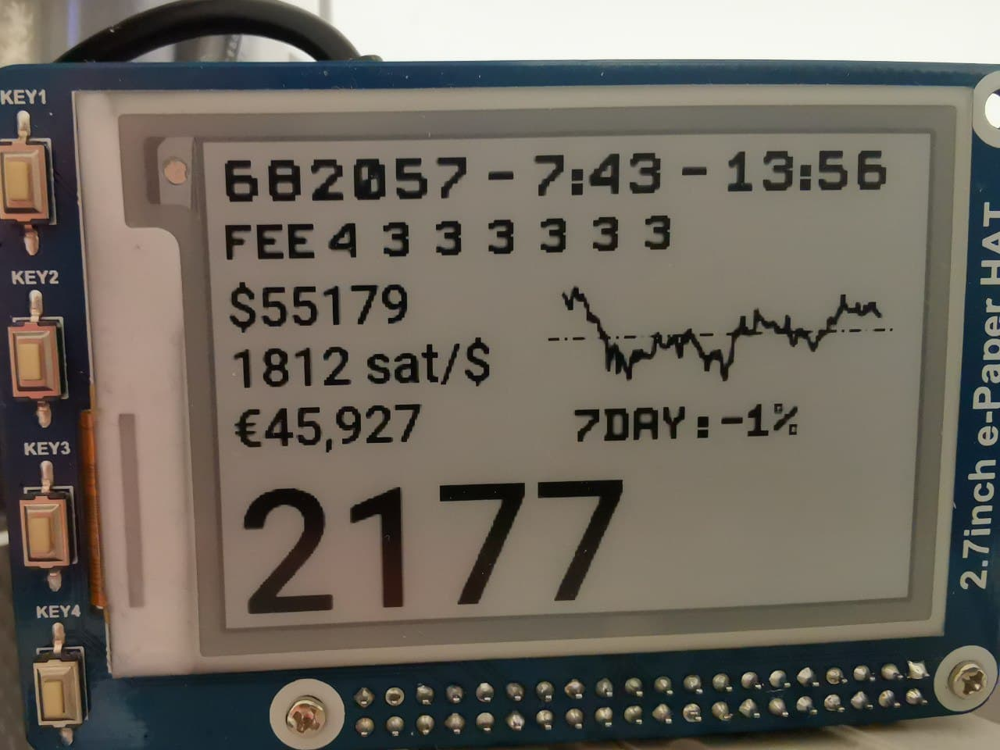
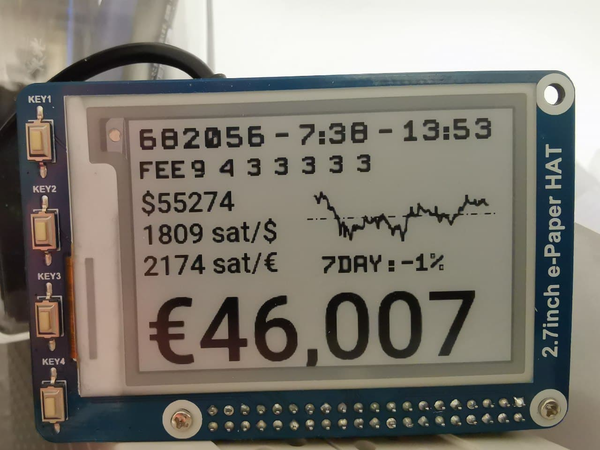
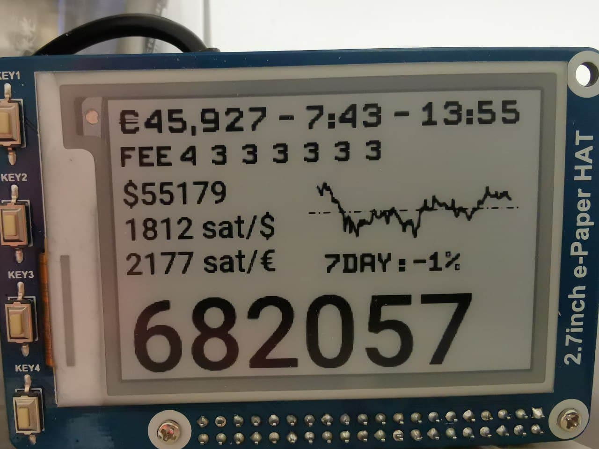

# bitcoin-ticker
bitcoin-ticker is a E-ink ticker that shows usefull information about bitcoin. Due to the limited refresh lifetime, new information is currently shown every 5 minutes and whenever a new block arrives.









## Hardware

* waveshare 2.7 e-Paper HAT (e.g. from [berrybase](https://www.berrybase.de/sensoren-module/displays/epaper-displays/2.7-264-215-176-epaper-display-hat-f-252-r-raspberry-pi), [welectron](https://www.welectron.com/Waveshare-13354-27inch-e-Paper-HAT?utm_campaign=id), [reichelt](https://www.reichelt.de/entwicklerboards-display-epaper-2-7-schwarz-weiss-debo-epa-2-7-p224220.html))
* rasberry pi zero WH (e.g. from [berrybase](https://www.berrybase.de/raspberry-pi/raspberry-pi-computer/boards/raspberry-pi-zero-wh))
* Power supply Micro USB 5V (e.g. from [berrybase](https://www.berrybase.de/raspberry-pi/raspberry-pi-computer/stromversorgung/netzteile-fuer-die-steckdose/micro-usb-netzteil/ladeadapter-5v/1a-flache-bauform-schwarz))
* micro SD card with 16 GB or more (e.g. from [berrybase](https://www.berrybase.de/raspberry-pi/raspberry-pi-computer/speicherkarten/sandisk-ultra-microsdhc-a1-98mb/s-class-10-speicherkarte-43-adapter-16gb))
* Printed Case (e.g. Typ B from [ebay](https://www.ebay.de/itm/GEHAUSE-fur-2-7-264-176-ePaper-e-Ink-Display-HAT-und-Raspberry-Pi-Zero/384176908149) oder [ebay-kleinanzeigen](https://www.ebay-kleinanzeigen.de/s-anzeige/gehaeuse-fuer-2-7-e-ink-display-hat-rasp-pi-zero-typ-b/1807419003-225-8325))

I'm currently working on a 7.5 inch version with the following e-Paper:
* waveshare 7.5 V2 (e.g. from [berrybase](https://www.berrybase.de/sensoren-module/displays/epaper-displays/7.5-800-215-480-epaper-display-hat-f-252-r-raspberry-pi-v2))

The config.ini needs the following settings when using the 7.5 inch:
```
epd_type = 7in5_V2
orientation = 270
```


## Usage
### Ticker view
The Tickers the following information:
* Block height, Mean block intervall in minutes, Time
* Minimal Block fee for the first 7 blocks in mempool
* Dollar price of a bitcoin
* Satoshi per Dollar (also know as moskow time)
* Sotoshi per Euro
* Euro price of a bitcoin

Whenever a new block has arrived on the blockchain, the following information is shown for 120 seconds (can be disabled in the config.ini):
* Euro price of a bitcoin, mean block intervall in minutes, Time
* Minimal Block fee for the first 7 blocks in mempool
* Blocks in mempook, Number of transaction in mempool
* Blocks until next difficulty retargeting, est. difficulty multiplier, est. retarget time
* Block height

Due to the limited lifetime of 1000000 refreshes and an expected lifetime of 5 years, the refresh period has been set to 216 seconds.
### Buttons
There are four buttons which the following behaviour (Please be patient after pressing, the e-ink is quite slow):
1. Switch through different ticker views (views can be selected in the config.ini)
2. Switch BTC/fiat graph through 1, 3 and 7 days (Can be changed in the config.ini)
3. Switch the layout of the ticker (layouts can be selected in the config.ini)
4. Switch inverted mode

### Switching to ro-mode
Per default, the file system is mounted writable. When there is a empty ro file in /boot, the filesystem will remounted readonly.
```
sudo touch /boot/ro
```
enables the readonly remount. The file can also be created with a PC, similar to the ssh file.

### Switching between ro and rw mode
After logging in with ssh,
```
rw
```
remounts the file system with write support.
```
ro
```
switches back to readonly.
### Config.ini
It possible to personalize the ticker to your needs. After logging into your raspi with SSH, the config can be edited with
```
rw
nano config.ini
ro
```
After writing the change to the ini file, a restart of the btc-ticker service is needed:
```
sudo systemctl restart btcticker
```

### Update btc-ticker without reflashing the sdcard
After logging into the btc-ticker with SSH, the update can be started with
```
rw
./99updateMenu.sh
```
Select now:
* PATCH
* Patch menu
* PATCH
to update the ticker to the newest updates from git.

## Flash SDcard

* Downlad version 0.4.2 from [btc-ticker-0_4_2.img.gz](https://btc-ticker.com/btc-ticker-0_4_2.img.gz)
* Verify SHA256 checksum. It should be: `EAAC5AB9A9583011483E6865F54939F7D61074150CA98C9CAC102EE2692C4C9C`
* add `wpa_supplicant.conf` to the boot partition when mounted on PC
```
ctrl_interface=DIR=/var/run/wpa_supplicant GROUP=netdev
update_config=1
country=[COUNTRY_CODE]
network={
  ssid="[WIFI_SSID]"
  psk="[WIFI_PASSWORD]"
  key_mgmt=WPA-PSK
}
```
* replace `[COUNTRY_CODE]` with the ISO2 code (e.g. DE)
* Set `[WIFI_SSID]` and `[WIFI_PASSWORD]`
* On the first boot, the filesystem is mounted writable (Necessary for coping the wpa_supplicant.conf).
* When there is no wpa_supplicant.conf at /boot, the filesystem will be mounten readonly.


## Build SDcard from scratch

The SDcard build process is inspired by the great [raspiblitz](https://github.com/rootzoll/raspiblitz).

* Download lastest [raspios image](https://downloads.raspberrypi.org/raspios_armhf/images/)
* Write the Image to a SD card [Tutorial](https://www.raspberrypi.org/documentation/installation/installing-images/README.md)
* Add a `ssh` file to the boot partition when mounted on PC
* Add a `wpa_supplicant.conf` file, as shown in the section before. More information are also available [here](https://www.raspberrypi.org/documentation/configuration/wireless/headless.md)
* Login via SSH to `ssh pi@[IP-OF-YOUR-RASPI]` using password `raspberry`


The image can now be build with:
```
wget https://raw.githubusercontent.com/btc-ticker/btc-ticker/main/build_sdcard.sh && sudo bash build_sdcard.sh
```

After everything run through, it is possible to login with the password `btcticker`
In order to prepare everyting for release, run `/home/admin/XXprepareRelease.sh`. When you just want to use it for yourself, you do not need to run `/home/admin/XXprepareRelease.sh`.

## Changing the ssh password
In order to secure your btc-ticker in your local network, you should change the SSH password after setting up everything.
* Login via SSH to `ssh admin@[IP-OF-YOUR-RASPI]` using the password `btcticker`
* Change the password (this will be improved in the next release)
```
echo "pi:NEWPASSWORD" | sudo chpasswd
echo "root:NEWPASSWORD" | sudo chpasswd
echo "admin:NEWPASSWORD" | sudo chpasswd
```
Replace `NEWPASSWORD` with the new password.

## Used APIs
btc-ticker is using the following APIs:
* [mempool.space/api](https://mempool.space/api), which can also be run locally in e.g. raspiblitz
* [coingecko api](https://www.coingecko.com/en/api)
* [blockchain API v1](https://github.com/blockchain/api-v1-client-python) (only as backup, when mempool.space is not available)